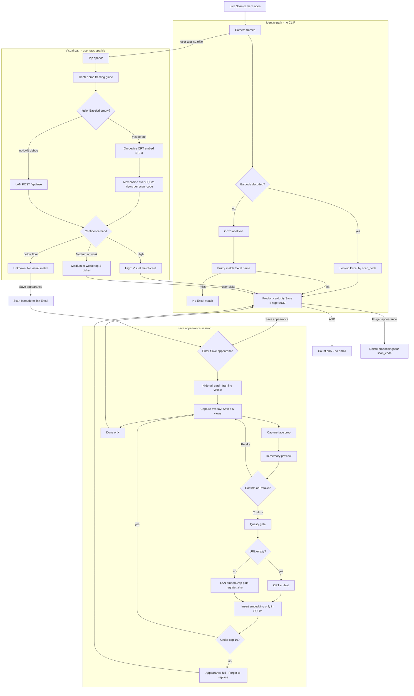

# CountX × MobileCLIP Integration

How the fusion / visual pipeline is wired into Live Scan in this app.  
Sibling pipeline repo: `POC 3 COUNTX Fusion Pipeline` (sandbox on port **8000**).

**Defaults:** MobileCLIP-S2 · Excel `scan_code` identity · no YOLO · user always confirms **ADD**.  
**Phase 5 default:** `fusionBaseUrl` empty → on-device visual; LAN is opt-in debug.

| Phase | Status | Where |
|-------|--------|--------|
| 0 — Registry + sandbox API | Done | Fusion pipeline |
| 1 — LAN bridge in app | Done | This repo |
| 2 — Visual match UX | Done | This repo |
| 3 — Save appearance enroll | Done | Both |
| 4 — Calibrate / harden | Done | Both |
| 5 — On-device ONNX | Done | Both |

Post–Phase 5 UX harden (same app): capture/verify overlay, embeddings-only gallery, multi-capture session, cap **10** views/SKU.

Demo scripts: [`DEMO_PHASE4.md`](DEMO_PHASE4.md) (LAN) · [`DEMO_PHASE5.md`](DEMO_PHASE5.md) (offline).

---

## End-to-end Live Scan workflow

1. **Live Scan (always on)** — **barcode → OCR → Excel**. MobileCLIP does **not** run in the camera loop. **ADD** counts only; it never enrolls.
2. **Product card** — shows Excel identity (name / code / scan_code fallback), quantity, **ADD**, plus **Save appearance** / **Forget appearance**.
3. **Tap ✨** — pauses briefly, center-crops the framing guide, runs visual identify:
   - **`fusionBaseUrl` empty (default):** on-device ORT embed → **I2I cosine** over local SQLite views (max score per `scan_code`).
   - **`fusionBaseUrl` set:** LAN `POST /api/fuse` (debug; orange banner if sandbox down).
4. **Bands** (see `lib/config/fusion_thresholds.dart`; keep parity with sandbox JSON):
   - **High** ≥ 0.70 + margin 0.08 → single Visual match card.
   - **Medium** ≥ 0.38 (or weak ≥ 0.30 floor) → top-3 picker.
   - Else → **unknown** (no forced seed SKU).
5. User still taps **ADD** after any visual suggestion.

---

## Save appearance (enrollment)

Barcode / Excel = **identity**. Visual gallery = **pack-face fingerprints** for ✨. Enrollment is always explicit and face-forward.

### Entry points

| From | What happens |
|------|----------------|
| Locked product card → **Save appearance** | Tall card fades; compact capture overlay (framing guide fully visible). |
| ✨ unknown / “None of these” → **Save appearance** | Wait for barcode to link Excel `scan_code`, then same capture overlay. |

### Capture session (multi-view)

1. Overlay shows product title + **`Saved N views`** (count only — no `/10` in the UI).
2. User frames pack face in the green guide → **Capture**.
3. **In-memory preview** → **Confirm** or **Retake** (human-in-the-loop). JPEG is **not** written to disk after Confirm.
4. On Confirm: quality gate → embed (ORT, or LAN `embedCrop` when URL set) → **SQLite embedding only** (`crop_path` null). LAN also `register_sku` with JPEG in memory when URL set.
5. Overlay **stays open** so the user can Capture more angles in one session → **Done** / **X** restores the product card for **ADD**.
6. Hard cap **`maxViewsPerScanCode = 10`**. At full: snack “Appearance full — Forget appearance to replace.” and session exits. Lookalike SKUs (e.g. Red Bull flavors) may use more views; most products need only a few.

### Forget appearance

- Deletes that `scan_code`’s **local embeddings** (and purges any legacy `product_crops/` leftovers).
- If LAN URL set, also `forget_sku` on the sandbox.
- Does **not** remove the Excel row. After Forget, ✨ will miss that SKU until Save appearance again.

### Visual gallery vs Excel

| | Excel price book | Visual gallery (SQLite) |
|--|------------------|-------------------------|
| Role | Identity / name / price / ADD | Pack-face embeddings for ✨ |
| What is stored | Uploaded sheet | 512-d float vectors only (~2 KB/view); **no JPEG gallery** |
| Size | Full sheet | Only products the user enrolled (and LAN seeds when URL set) |
| ✨ searches? | Maps winners to rows | Yes — nearest neighbor by max cosine over views |

Offline ✨ can only suggest products previously **Save appearance**’d on this phone (plus any rows still in SQLite). It does **not** search all Excel SKUs. Unenrolled faces → unknown, or (if above the weak floor) nearest enrolled neighbor — not a hardcoded brand.

---

## Visual mode switch

| Config | Behavior |
|--------|----------|
| `fusionBaseUrl = ""` | On-device ORT + SQLite I2I |
| `fusionBaseUrl = "http://<PC-IP>:8000/"` | LAN fuse / register / forget (debug) |
| `mobileClipModelBaseUrl` | HTTP base for download-on-first-run (`…/models/`) |

**Full restart required** after changing these `const` values (hot reload is not enough).

---

## Phase 5 — On-device MobileCLIP (done)

### What changed in this app

| File | Role |
|------|------|
| `lib/config/config.dart` | Empty `fusionBaseUrl` by default; `mobileClipModelBaseUrl` for model HTTP |
| `lib/config/fusion_thresholds.dart` | Shared visual / quality bands (parity with sandbox JSON) |
| `lib/services/mobileclip_model_store.dart` | Download/cache `mobileclip_visual.onnx` + `.onnx.data` (~147 MB) into documents `mobileclip/` |
| `lib/utils/mobileclip_preprocess.dart` | 256 bicubic + CLIP mean/std (sandbox parity) |
| `lib/services/mobileclip_onnx_service.dart` | `flutter_onnxruntime` file session → L2 512-d |
| `lib/services/local_gallery_search.dart` | Max cosine over SQLite views (I2I-only; no T2I) |
| `lib/services/product_identification_service.dart` | On-device branch when URL empty; Excel mapping + bands |
| `lib/services/product_enrollment_service.dart` | Quality → embed → SQLite only; LAN register when URL set; Forget |
| `lib/services/product_embedding_repository.dart` | Gallery DB; `maxViewsPerScanCode = 10`; `purgeAllCropFiles()` |
| `lib/screens/live_scan_screen.dart` | Cascade, ✨, capture/verify overlay, multi-capture, model banner |
| `pubspec.yaml` | `flutter_onnxruntime` |
| `ios/Podfile` | iOS 16 + static linkage (ORT) |
| `android/app/proguard-rules.pro` | Keep `ai.onnxruntime.**` |
| `test/mobileclip_preprocess_parity_test.dart` | Dart vs Python preprocess cosine ≥ 0.99 |
| `test/local_gallery_search_test.dart` | Cosine unit checks |
| `DEMO_PHASE5.md` | Offline demo script |

### Sibling pipeline (not this git repo)

| File | Role |
|------|------|
| `countx_live_preview_sandbox/server.py` | `/api/fuse`, `/api/register_sku`, `/api/forget_sku`, `/models/` (view cap **10**) |
| `countx_live_preview_sandbox/fusion_thresholds.json` | Threshold source of truth with Dart |
| `scripts/export_phase5_parity_fixture.py` / `assert_phase5_parity.py` | Python ORT cosine ≥ 0.99 |
| `scripts/assert_threshold_parity.py` | JSON ↔ Dart threshold lock |
| `dataset/phase5_parity/` | Fixture JPEG + expected tensor/embedding |

### Locked decisions

- **Model delivery:** download-on-first-run (not bundled in APK); USB/`adb` fallback.
- **Offline scoring:** I2I-only over SQLite (no on-device text encoder).
- **Persistence:** embeddings only after Confirm; no permanent local crop gallery.
- **Mode switch:** empty URL → on-device; non-empty → LAN debug.
- **Bands:** shared thresholds; tweak JSON + Dart together if phone I2I drifts.

### Model install (first run)

1. Start sandbox (`:8000`) so `/models/mobileclip_visual.onnx(.data)` is reachable, **or**
2. USB / `adb push` both files into app documents `mobileclip/` (same filenames).
3. Live Scan teal banner → **Download** (~147 MB once). After that, airplane mode works for ✨.

Expected sizes: graph ~3.26 MB, weights ~137.4 MB.

---

## Phase 0–4 (done)

See git history / [`DEMO_PHASE4.md`](DEMO_PHASE4.md). Shared thresholds: sandbox `fusion_thresholds.json` ↔ `lib/config/fusion_thresholds.dart`.

Quick band reminder: High ≥0.70+margin; Medium ≥0.38; weak picker ≥0.30; server unknown floor 0.32; auto-accept metrics exist for LAN resolution but the app **never** auto-ADDs.

---

## Setup checklist

**On-device (default)**

1. `AppConfig.fusionBaseUrl = ""`.
2. `AppConfig.mobileClipModelBaseUrl` = `http://<PC-LAN-IP>:8000/models/` (or empty + USB/`adb`).
3. Start sandbox if downloading over Wi‑Fi.
4. Full restart → Download model once → barcode lock → Save appearance (Capture → Confirm → optional more → Done) → airplane / stop sandbox → ✨.

**LAN debug**

1. Start sandbox (`.\start_sandbox.ps1` or venv `server.py`).
2. Set `fusionBaseUrl` to `http://<PC-LAN-IP>:8000/`.
3. Full restart; ✨ uses `/api/fuse` (scores may differ from on-device I2I — compare rank/band/top-3, not raw equality).

---

## Explicit non-goals (yet)

- Auto-CLIP while scanning.
- Auto-add from visual match.
- Auto-enroll on ADD or barcode lock.
- Classifying all Excel rows without enrollment.
- Mixing SigLIP with MobileCLIP.
- YOLO in the live path.
- Bundling 147 MB into the APK/IPA (download / USB instead).
- On-device text encoder / T2I blend (I2I-only offline).
- Permanent on-device JPEG crop gallery / Photos export.
- Per-SKU custom caps (global hard cap of 10 only).

Display: some Excel rows leave Item Description empty and put the label in Item Code — Live Scan / ✨ fall back to `code` before showing the barcode.
